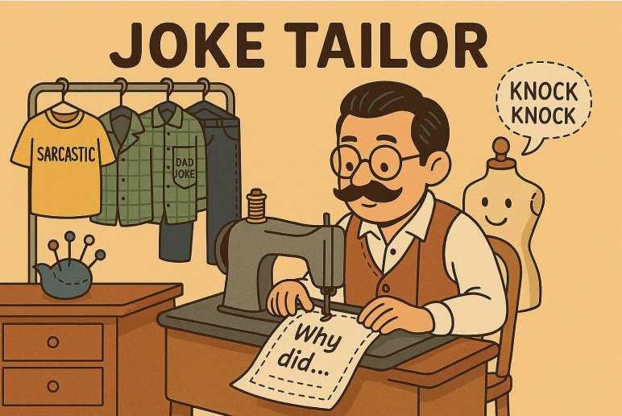
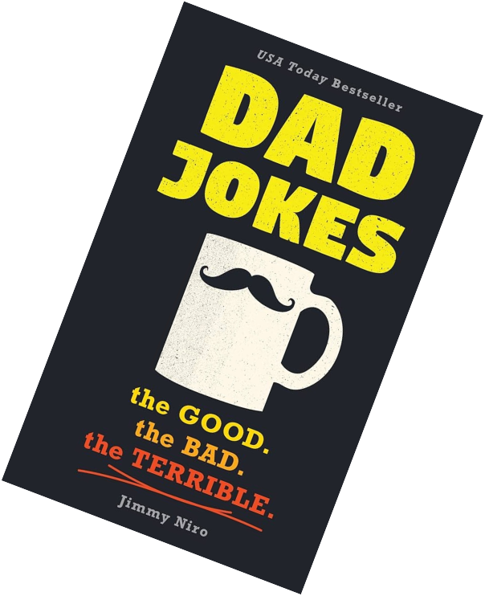
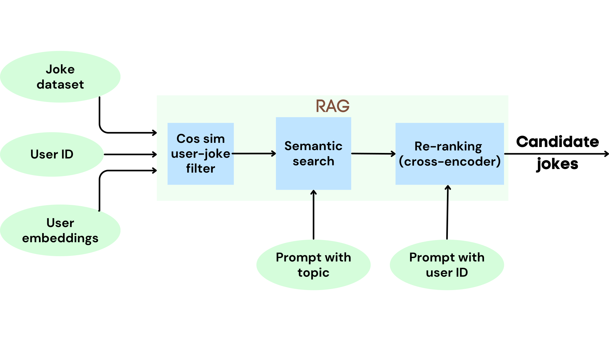
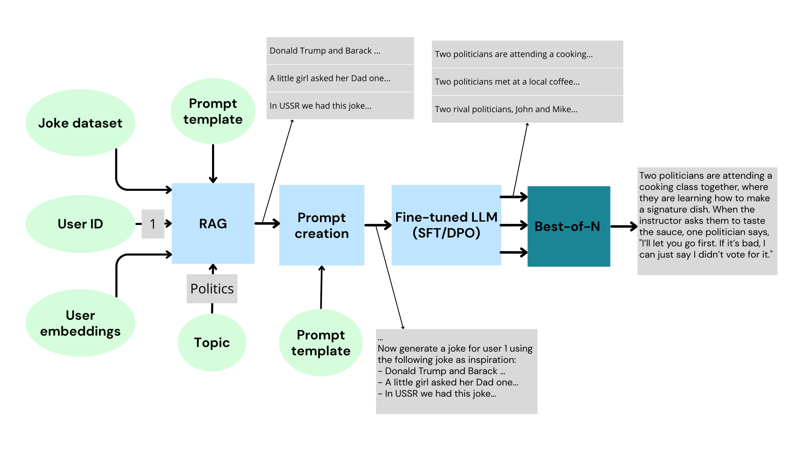
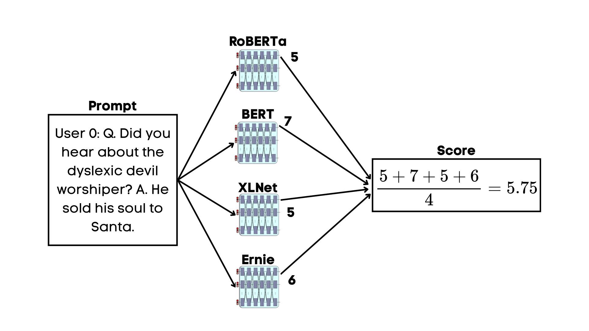
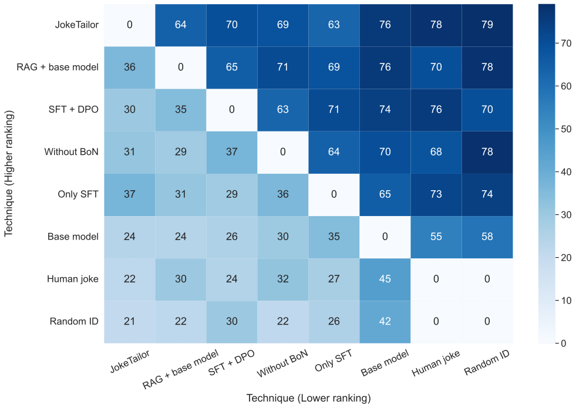

# My Master Thesis: Personalized Humor Generation with Language Models

*TL;DR: I built a system called JokeTailor that combines multiple machine learning techniques  to generate personalized jokes tailored to your sense of humor and achieving a 76% preference rate over non-personalized baselines. Additionally, I made JestFitter, a model to proxy the human evaluations of personalized jokes.*

## The Challenge: Making LLMs Funny for You Specifically

Everyone has a different sense of humor. What makes one person laugh might make another person cringe. While large language models like GPT-4 can generate jokes, they struggle to adapt them to individual preferences. My thesis tackled this question: **Can we personalize humor generation to match someone's specific taste?**

The challenge was threefold:
1. **Subjectivity**: Humor is incredibly personal and varies wildly between people
2. **Quality**: LLMs tend to generate generic jokes or copy existing ones rather than creating original, funny content. It often seems like they are writing a "Best Dad Jokes" book.
3. **Evaluation**: How do you measure if a joke is "good" when everyone has different preferences?
 

## The Solution: JokeTailor

I developed **JokeTailor**, a system that personalizes joke generation using only a small amount of user feedback (ranking a handful of existing jokes). The system combines three powerful techniques:

### 1. Retrieval-Augmented Generation (RAG)
Think of this as giving the LLM inspiration. Based on a user's preferences and a topic, JokeTailor first retrieves similar jokes from a dataset of 8,500+ jokes. This happens in three steps:
- **User-based filtering**: Find jokes similar to what the user likes using their preference embedding
- **Topic-based search**: Further filter jokes related to the requested topic
- **Re-ranking**: Use a cross-encoder to rank jokes by predicted user-specific ratings

These retrieved jokes serve as examples that guide the style and humor structure of new generations.

### 2. Fine-tuned Language Model
I fine-tuned a 32B parameter model (Qwen2.5-32B-Instruct) using two techniques:
- **Supervised Fine-Tuning (SFT)**: Taught the model the general format and style of jokes
- **Direct Preference Optimization (DPO)**: Aligned the model with user-specific humor preferences using 2,205 chosen-rejected joke pairs

The fine-tuned model is prompted with a large Chain-of-Thought (CoT) prompt that makes it analyze example jokes, generate punchlines, and construct appropriate setups.

### 3. Best-of-N Sampling
Since LLMs can be unpredictable, the system generates 5 candidate jokes and uses a fine-tuned RoBERTa model to score each one based on the user's preferences. Only the highest-rated joke is returned, filtering out duds.

## The Secret Weapon: JestFitter

Human evaluation is slow and expensive. To iterate quickly during development, I built **JestFitter**, an automated evaluation system that predicts how much a specific user would rate a joke. It's an ensemble of four encoder models (RoBERTa, BERT, XLNet, and ERNIE; yes, computer scientist clearly have fun naming things) trained on the Jester dataset of user joke ratings.

While not perfect (achieving a Spearman correlation of 0.28 with human judgments), JestFitter proved invaluable for rapid prototyping and comparing different system configurations. It outperformed existing humor detection models and even GPT-4o when predicting user-specific preferences.

## The Results: Does It Actually Work?

I conducted a two-phase human study with 85 participants:

**Phase 1**: Users ranked existing jokes to provide preference feedback  
**Phase 2**: Users ranked jokes generated by JokeTailor and various baseline systems

The results were compelling:
- **JokeTailor vs. Base Model**: Preferred **76%** of the time (my year was not all for nothing, yeey)
- **JokeTailor vs. Random User ID**: Preferred **79%** of the time (proving personalization matters, yeeey!)
- **JokeTailor vs. Random Human Jokes**: Preferred **78%** of the time (we beat silly dad jokes, yey)
- **JokeTailor vs. All Ablations**: Preferred **63-76%** of the time (every component was needed for the results, ye yey)

All differences were statistically significant (p < 0.05). Each component of the system contributed meaningfully to the final performance.

### Example Generated Jokes

Here's a joke JokeTailor generated for one user:

> *A man walked into a Florida bar with his crocodile and asked the bartender: "Do you serve comedians here?" "Sure." "Good. One beer for me and a comedian for my crocodile."*

Compare this to the base model without personalization:

> *How many comedians does it take to change a light bulb? Just one, but he'll make sure to leave the audience in the dark while he does it.*

The personalized version matched that specific user's preference for absurdist, unexpected humor rather than standard joke formats.

## What I Learned

### Technical Insights
- **RAG is powerful for personalization**: Retrieving relevant examples aligned with user preferences significantly improved joke quality
- **Prompt engineering is hard and unsolved**: I spent a lot of time tweaking the prompts, looking at the resulting outputs trying to see what went wrong, adding extra steps. JestFitter really helped speed up the process, testing out a bunch of prompts and seeing which ones scored higher.

### Broader Lessons
- **Automated evaluation is crucial for subjective tasks**: JestFitter enabled rapid iteration that would have been impossible with human-only evaluation
- **Humor generation is possible, even with small LLMs**: Earlier research questioned whether LLMs could generate truly original humor, but with the right techniques, they can produce jokes people genuinely prefer over human-written ones
- **Presenting science is a form of art**: Writing the master thesis text, presenting results, defending results... all these parts of the science communication taught me valuable lessons on how to communicate technical designs and results in an effective and entertaining way.

---

The full code, models, and datasets are available on [GitHub](https://github.com/sepva/JokeTailor) and [HuggingFace](https://huggingface.co/SeppeV), and I'm currently working on publishing a paper based on this research. If you want to read the full technical details, the complete thesis text is also available on [GitHub](https://github.com/sepva/thesis_text/blob/main/masterproef.pdf).

I want to thank my thesis advisor, [Thomas Winters](https://thomaswinters.be/), for all his advice and giving me the opportunity to now write a paper about this thesis.

Now if you'll excuse me, I need to go explain to my friends and family why I spent a year making an AI tell jokes... 😅

