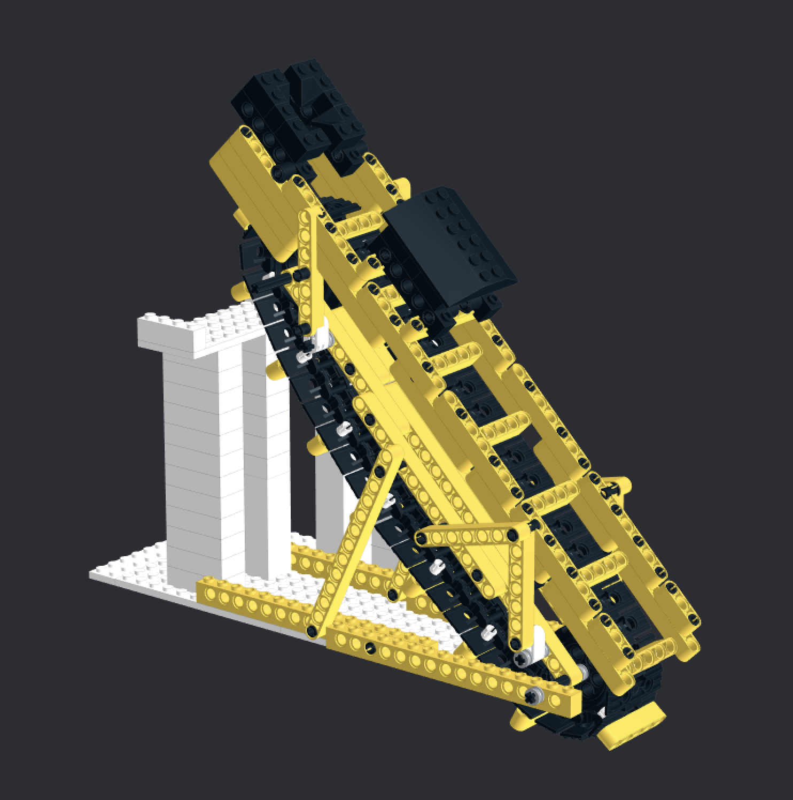
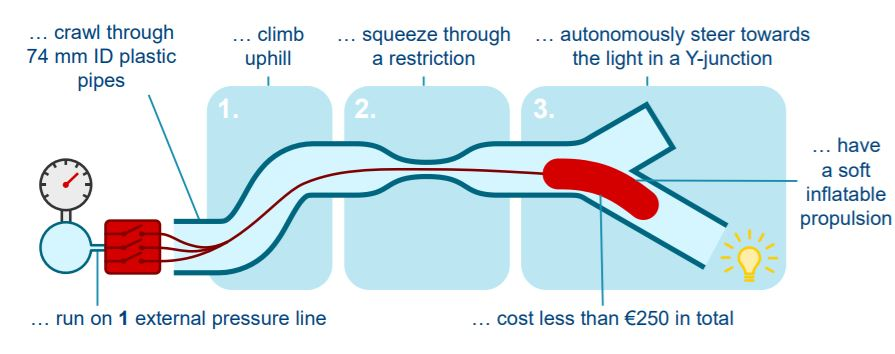
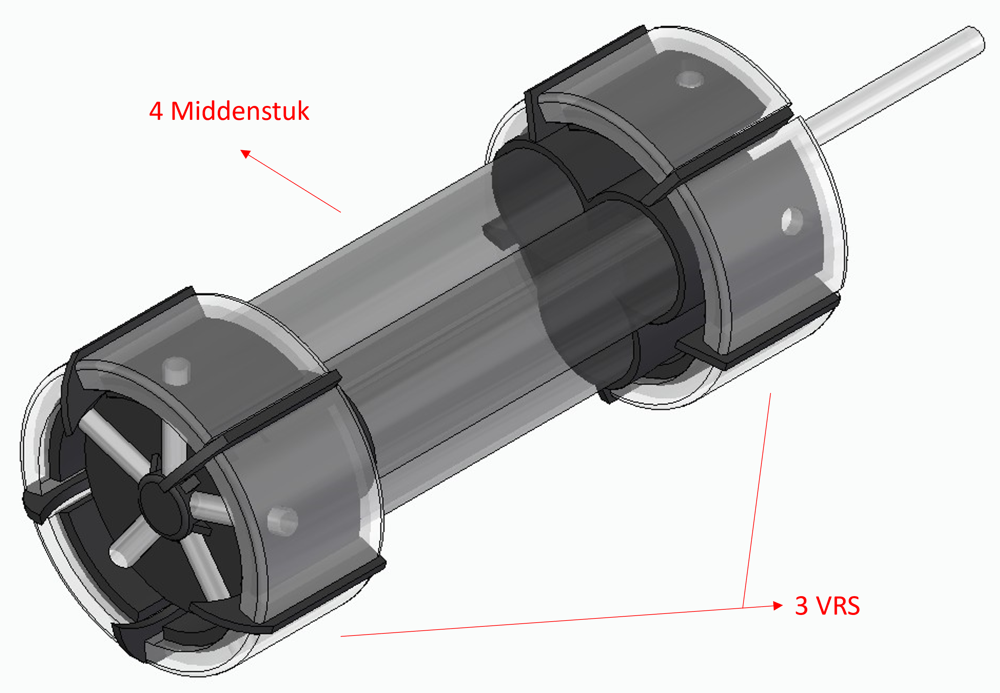
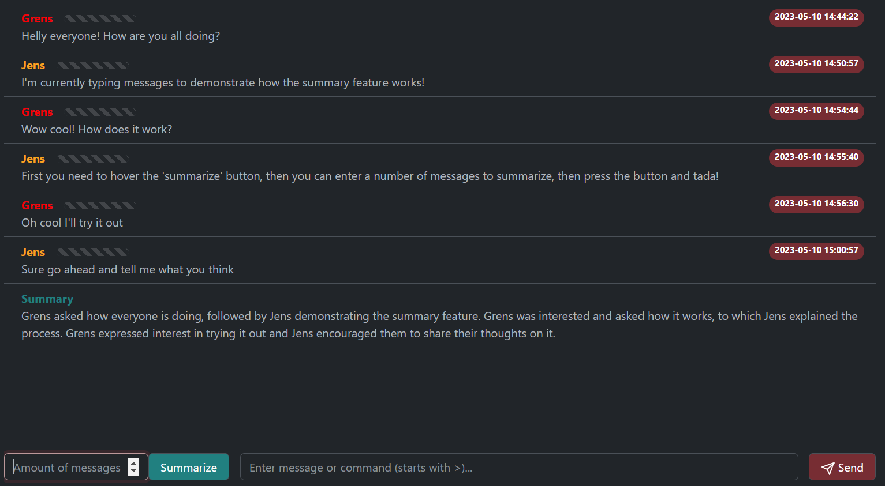
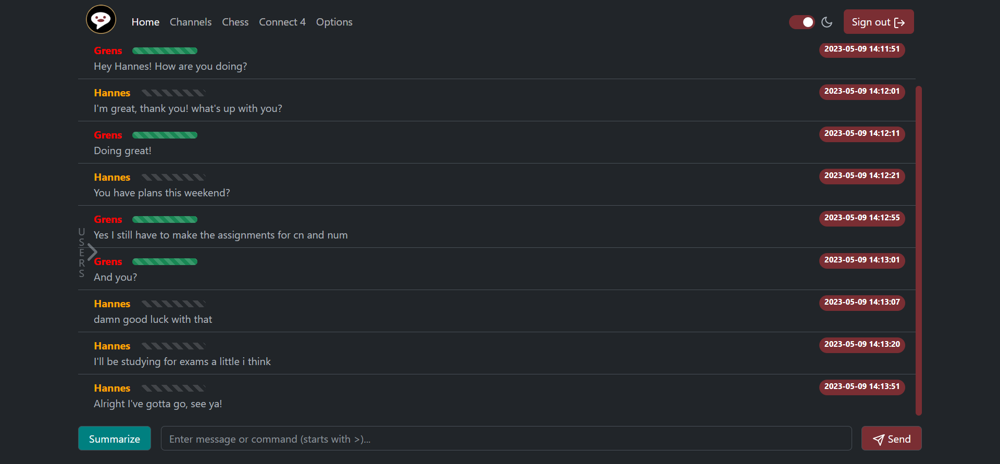
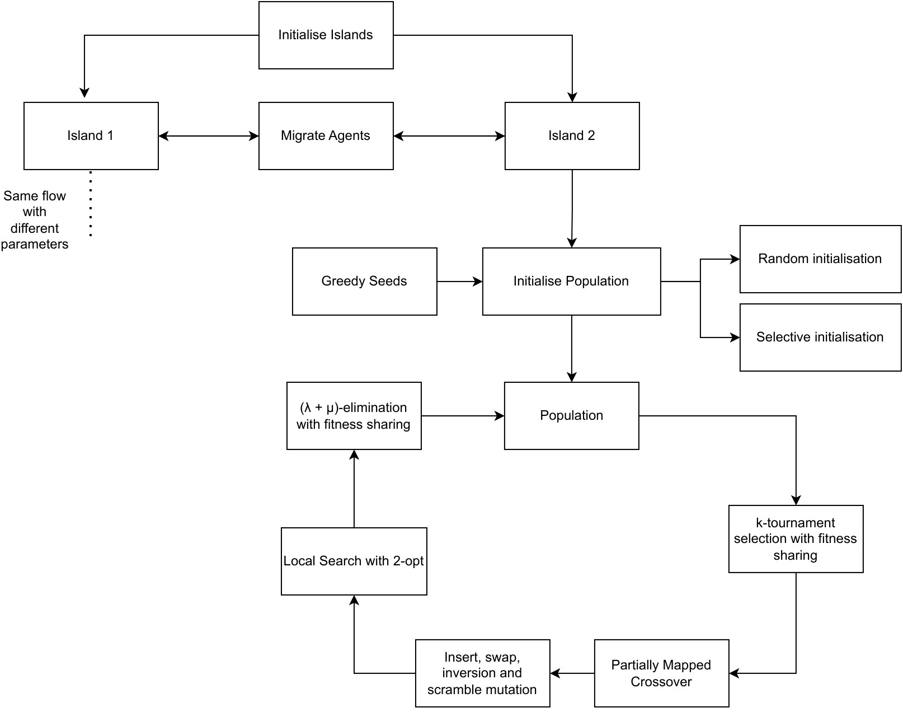

# Engineering and Computer Science projects

*TL;DR: Over my 5 years of studying, there were a lot of fun and educational project...*

## First year Engineering project: the grain-transporter

In our first year as bachelor students in Civil Engineering we got the following problem to solve:
- There are 3 silos with 3 different kinds of grains
- We have to get the right amount from each silo and combine them in a collection basket
- The machine doing this must be connected to a place on the ground, it can't be a car-type solution
- We were constrained in budget of €150

### Our solution

We built a sort-of escalator that could move between the silos and scoop up grains; with at the top a weighting mechanism. We built this monstrosity in Lego's (not really cost effective, but really easy to prototype) and used an Arduino for driving the motors and sensors. A PCB was made and all components were soldered on there. In the end, after a long final night, our design worked (sort of). The weight sensor was not that great and a bit too sensitive for the falling grains, making the measurements quite inaccurate.

### My contributions

I was in charge of the electronics, so:
- Finding the right kinds of motors and sensors
- Testing out the electronics with the Arduino
- Writing the program to do the final test af getting the grains out the silos
- A lot of painful debugging (why don't these motors work correctly)
- I did not design the PCB, but did help with the electronic schema

## Second year Engineering project: Worm-X

In our second year we had the following problem to solve:

### Our solution

We made Worm-X, a soft robot consisting of 3 elastic middle tubes and at each end an elastic circular tube. It moves based on the elastic expansion of the balloon-like structures. The tubes are filled with air by opening pneumatic air-valves and  In the following videos you can see the [envisioned](https://www.youtube.com/watch?v=WVDHXbSl0vI) and [real movement](https://www.youtube.com/watch?v=NwKiKeB2W7w) of Worm-X. In the end it had all required features, although it was quite slow and brittle.

### My contributions

Again, I was in the electronics/programming team. This time I really did (together with team mates) design the electronic schema, find the right air-valves (working with limited budget), soldered everything on a PCB and wrote the code before any physical robot was working. Bringing the physical design and electronics together went surprisingly smooth this time, with the electronics and code working installed on the design in a few sessions. Apart from the real work, I also made a Worm-X game for people to play on the demo-day, and it was a wild success.

 

## Third year Engineering project: Chapp

In our third year we had to develop a chat application called **Chapp**. The goal was to create a fully working chat platform with both a client-server architecture and unique features that would set it apart from standard messaging apps. Our team decided to focus on two main innovations: using AI to help users catch up on conversations and implementing keystroke-based security to detect potential imposters.

### The Challenge

Modern chat applications need to solve two key problems:
1. **Information overload**: People miss conversations and need a quick way to catch up
2. **Account security**: How do you know the person messaging you is really who they claim to be?

We tackled both of these with some cool AI and machine learning techniques!

### My Main Contributions

I primarily worked on two features that became core parts of the application:

#### 1. AI-Powered Conversation Summarization

I implemented a feature that uses OpenAI's GPT-3.5-turbo model to generate summaries of conversations. Here's how it works:

- Users can select to summarize anywhere from 1 to 100 of the most recent messages
- When they click the summarize button, a `GENERATE_SUMMARY` command is sent to the server
- The server fetches the selected messages and formats them as `<username>: <message>`
- This formatted conversation gets sent to the OpenAI API with the prompt: *"Write a summary of the next messages that are given in format: <username>: <message>"*
- The AI generates a concise summary (max 500 tokens) that appears only in that user's chat

The feature also respects privacy - channel creators can opt out of having the AI functionality enabled, clearly indicated by a robot icon in the channel list.

#### 2. Keystroke-Based Intruder Detection

This was the more complex and fascinating feature! I implemented a security system that authenticates users based on their typing patterns. The idea comes from the paper "Keystroke analysis of free text" by Gunetti and Picardi.

**How it works:**

**Data Collection:**
- When users type messages, we capture the timing between keystrokes (2-grams and 3-grams)
- We filter for human-like typing speeds (between 159ms and 769ms between keystrokes, giving an 86.64% confidence interval)
- This data is stored locally in the browser's localStorage (for privacy reasons, not in our database)
- We calculate a "distance" metric between typing patterns using r-measures and a-measures
- An exponential moving average (α = 0.1) tracks each user's typical typing pattern over time, roughly averaging over 20 messages

**Real-Time Analysis:**
- Every new message gets compared to the user's stored typing pattern
- We use **Grubb's test**, a statistical outlier detection method, to identify suspicious typing
- The test generates a "trust value" between 0 and 1: 
  - Green (trust value near 1) = typing pattern matches the user
  - Red (trust value near 0) = likely an imposter
- To handle limited data, we generate 25 normally-distributed random points based on the stored mean and standard deviation

**The Trust Bar:**
Users see a colored bar next to each username showing how much they can trust that person's identity. This visual indicator makes security status immediately obvious.

**Automatic Protection:**
If someone's typing pattern is too different from their historical pattern, they get automatically logged out and must re-enter their password. The sensitivity of this can be adjusted by users (default is 90%). At 48% sensitivity, there's only a 3% false positive rate (falsely logging out the real user) while still catching 74% of imposter attempts!

**Performance Results:**
We tested this extensively with our team. Our experiments showed:
- The typing distance measurements follow a normal distribution (validated with Lilliefors, Kolmogorov-Smirnov, and Jarque-Bera tests)
- Combined r- and a-measures with 2- and 3-grams significantly outperformed other configurations
- The system works as a practical secondary security measure

### Other Cool Features

While I focused on summarization and keystroke detection, our team also built:
- **Public and private channels** with password protection
- **Chess and Connect Four games** for users to play while chatting
- **Dark mode** (because every good app needs dark mode, duh 😎)
- **User profiles** with customizable username colors, biographies, and activity statistics
- **Real-time user status indicators** showing who's online
- **Message loading** with pagination for better performance

### The Tech Stack

- **Frontend**: TypeScript, HTML, SCSS, Bootstrap 5, Webpack
- **Backend**: Node.js with WebSocket (wss) connections
- **Database**: MongoDB with Mongoose ODM
- **AI**: OpenAI API (GPT-3.5-turbo)
- **Security**: HTTPS/WSS with TLS certificates from Render
- **Deployment**: Render (free hosting with automatic HTTPS)

### What I Learned

**Technical Skills:**
- **Statistical analysis in practice**: Implementing Grubb's test, exponential moving averages, and validating the normality assumption taught me how to apply statistics to real-world problems
- **Real-time systems**: Working with WebSockets for bidirectional client-server communication
- **Privacy-first design**: Using localStorage instead of centralized storage for sensitive biometric data
- **API integration**: Working with paid APIs and managing costs (we had to set hard limits on the number of messages to keep OpenAI costs reasonable)
- **Machine learning for security**: Turning academic papers into working code

**Broader Lessons:**
- **Balancing features and resources**: We had to make tough choices (like limiting summaries to 100 messages) to keep the project feasible
- **User experience in security**: Making security features visible and understandable through the trust bar, rather than hidden
- **Team coordination**: This was a complex project with multiple subsystems (games, channels, security, AI) that all had to work together

## Evolutionary Algorithms project: Solving the Traveling Salesman Problem

For my Evolutionary Algorithms course, I built a sophisticated genetic algorithm to solve the classic **Traveling Salesman Problem (TSP)**, finding the shortest route that visits all cities exactly once. The challenge was to beat a greedy heuristic benchmark within a 5-minute time limit for problems ranging from 50 to 1000 cities.

### The Approach: [Island Model Evolution](https://algorithmafternoon.com/genetic/island_genetic_algorithms/)

I implemented an **Island Model** with two parallel populations running on separate CPU cores:

**Island 1 (Explorer)**: Focused on maintaining diversity and exploration with larger populations and fitness-sharing to prevent premature convergence

**Island 2 (Exploiter)**: Started with greedy nearest-neighbor solutions and aggressively optimized them with local search. This island could completely restart if it converged too early.

The islands would "migrate" their best solutions to each other every epoch, balancing exploration and exploitation.

### Key Techniques

- **Greedy seed initialization**: Started with solutions from a nearest-neighbor heuristic, then mutated them to create diverse starting populations
- **Fitness-sharing**: Used the number of different cities at the same index as a distance metric to maintain diversity
- **Self-adaptive mutation**: Each solution had its own mutation rate (α) that evolved alongside the route itself
- **Partial mapped crossover**: Preserved city order from both parents while creating diverse offspring
- **2-opt local search**: Eliminated crossing paths by reversing random route sections

This project taught me how to balance exploration vs. exploitation, tune complex hyperparameter spaces, and implement parallel evolutionary algorithms that can actually outperform traditional heuristics!

## Machine Learning project: Dots-and-Boxes Game Agent

For my ML course, I built an intelligent game agent for [**Dots-and-Boxes**](https://en.wikipedia.org/wiki/Dots_and_boxes) that combines Monte Carlo Tree Search (MCTS) with neural networks to play across different board sizes.

### The Challenge

Dots-and-Boxes is deceptively complex. While the rules are simple (connect dots to form boxes and score points), the strategy revolves around **chains** - sequences of boxes that force your opponent into giving you multiple boxes. The challenge was to build an agent that could:
1. Beat benchmark agents (random and MCTS with random rollouts) on 7x7 boards
2. Generalize to other board sizes without retraining
3. Recognize and exploit chains strategically

### The Multi-Stage Strategy

Instead of using one approach for the entire game, I implemented a **dynamic strategy** that adapts as the game progresses:

**Early Game** (opening moves): Pure MCTS with random rollouts for efficient exploration when the state space is large

**Mid Game** (after ~86 moves): Switches to a neural network trained specifically on midgame positions. For each possible move, the agent evaluates the resulting state and picks the move that maximizes winning probability

**End Game** (last 13, 10, and 8 moves): Uses progressively specialized neural networks trained with minimax-solved positions for near-perfect play

### The Neural Networks

The networks predict win probability (values between -1 and 1) using a carefully designed feature vector:
- Number of half-open and closed chains (the most critical strategic information)
- Current score difference
- Distribution of boxes by number of surrounding edges
- Number of moves made
- All features normalized for generalization

**Training approach:**
- **Endgame models**: Trained using minimax to solve randomly generated states with 10-20 moves remaining (very low loss ~0.04 MSE)
- **Midgame models**: Trained iteratively using self-play MCTS - the network improves by generating better training data for itself over multiple iterations (higher loss ~0.85 due to noisy MCTS data, but still effective)

The architecture is simple but effective: input layer (9 features) → hidden layer (200 nodes) → output (1 node), all using tanh activation.

### The Results

The agent absolutely crushed it! Testing across 400 games per board size:

| Board Size | vs Random | vs MCTS | Chain Recognition |
|-----------|-----------|---------|-------------------|
| 3x3 | 98.75% | 97.75% | 93.3% complete chains |
| 5x5 | 99.50% | 100% | 90.7% complete chains |
| 7x7 | **100%** | **100%** | 95.5% complete chains |
| 8x8 | **100%** | **100%** | 95.5% complete chains |

**Chain strategy mastery**: When chains were available, the agent not only played them completely (90-95% of the time) but also avoided leaving chains for opponents (71-83% "no chains left" rate). This shows it truly understands the core strategy of Dots-and-Boxes.

**Generalization success**: The agent trained on 7x7 boards performed equally well on larger boards. In fact, performance improved on larger boards because strategic play matters more than luck when there are more moves.

### What I Learned

- **Game phase matters**: Different stages of a game can require completely different strategies. The multi-stage approach significantly outperformed any single-strategy agent
- **Feature engineering is crucial**: Hand-crafted features based on domain knowledge (chains, box distributions) worked better than raw board states
- **Iterative self-play works**: Even with noisy training data from MCTS self-play, the network learned effective strategies through iterative improvement
- **Specialization vs. generalization tradeoff**: Specialized endgame models (low MSE) provided near-optimal play, while more general midgame models (higher MSE but broader applicability) handled the complex middle phases

This project showed me how to combine classical AI techniques (MCTS, minimax) with modern neural networks, and how to design agents that adapt their strategy dynamically based on game state!
