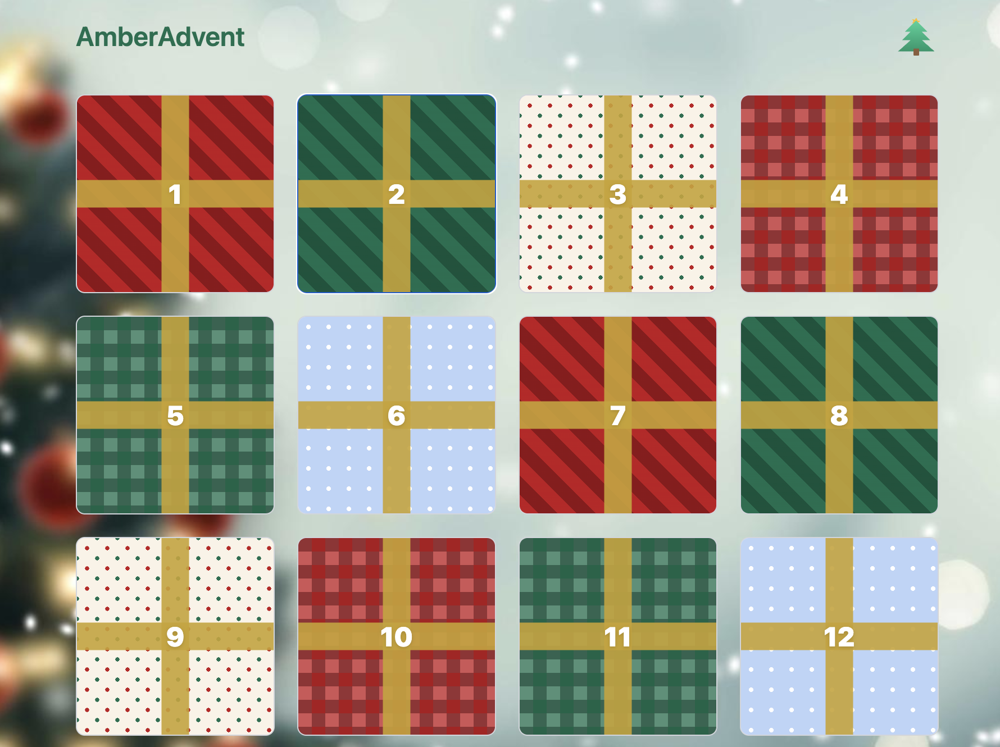

# AmberAdvent: A Digital Advent Calendar Gift

*TL;DR: I built an interactive online advent calendar with 24 virtual "doors" as a personal gifts for my girlfriend. Each day unlocks to reveal a new surprise, from photos of gifts to sweet messages. Built with React and deployed on Cloudflare Pages.*

## The idea

December 2025 was approaching, and I wanted to do something special for my girlfriend. Traditional advent calendars are great, but I'm a computer guy, surely I could make something more personal and tech-y? So I decided to build a digital advent calendar where she could open a new "door" each day throughout December to discover daily surprises.

The concept was simple: 24 clickable gift boxes that unlock day by day, each revealing either a photo of a physical gift she'd receive, a sweet message, or hints about upcoming surprises.

## The implementation

You can check it out at [AmberAdvent](https://amberadvent.pages.dev/) (though you won't be able to open any doors, as december is passes; *or maybe you would...*)



### Tech stack

I kept it straightforward with modern web tools:
- **React + Vite**: For the UI and fast development experience
- **Tailwind CSS**: For styling those festive gift boxes
- **Cloudflare Pages**: Free hosting with automatic deployments from GitHub
- **Markdown with frontmatter**: For content management (each day's surprise is a simple `.md` file)

### How it works

The calendar shows 24 wrapped gift boxes with festive patterns (stripes, plaids, polka dots, snowflakes). Each box is locked until its corresponding date in December. When you click on an unlocked box:

1. The gift wrapping "unwraps"
2. A modal opens showing that day's content (usually a photo with a caption)
3. The box stays open on subsequent visits (using localStorage to remember which days were opened)

The date gating logic uses Brussels timezone (because that's where we are), and each day becomes available at midnight. Content for each day lives in simple Markdown files with YAML frontmatter that looks like this:

```markdown
---
title: Dag 01
type: image
imageUrl: /assets/2025/pyama_amber.jpeg
alt: Warm Christmas pajamas
---
Warm Christmas pajamas to survive the cold bedroom ;))
```

## What I learned

**Simple is beautiful**: This project didn't need a complex backend, authentication, or fancy frameworks. Static files, localStorage, and client-side logic did everything I needed.

**One day with Github Copilot is enough**: I spent just one day to build everything (far more days to find the personal gifts, LLMs are not of that much help here). For building simple, static website, with clear requirements and a good plan, you can really quickly build something.

## The outcome

She loved it!