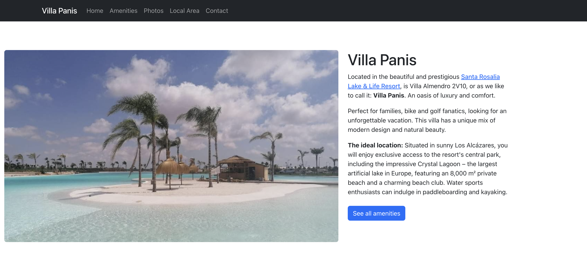

# Villa Panis: A Vacation Rental Website

*TL;DR: I built a professional vacation rental website for my family's villa in Spain. A React-based information portal showcasing amenities, photos, and local attractions to drive Airbnb bookings. Deployed on Cloudflare Pages.*

## The idea

My family owns a beautiful villa in Los Alcázares, Spain - Villa Almendro 2V10 in the Santa Rosalia Lake & Life Resort. While we list it on Airbnb, we wanted something more: a professional website that would give potential guests a comprehensive look at the property, the resort facilities, and everything the Costa Cálida region has to offer. The goal was to create a polished information portal that would inspire bookings while keeping the actual booking process simple through Airbnb.

## The implementation

The website is live at the [villa's booking site](https://melios.be/home).

### Tech stack

- **React 19 + Vite**: For a fast, responsive single-page application
- **Cloudflare Pages**: Free, fast hosting with automatic deployments from GitHub

### The development approach

I created a detailed AGENTS.md file to guide development, basically a comprehensive guide for working with the codebase. It includes:
- Project structure and technical stack overview
- Content requirements for each page
- SEO guidelines and target keywords
- Code standards and styling approaches
- Step-by-step workflow for adding new features or content
- Deployment procedures

This made the development with Github Copilot really easy. I gave it some documents my parents made about the house (amenities, photos, local area) and it put the information and photos of these documents in the website.