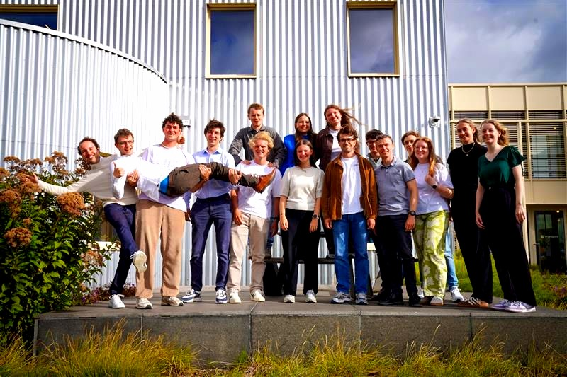
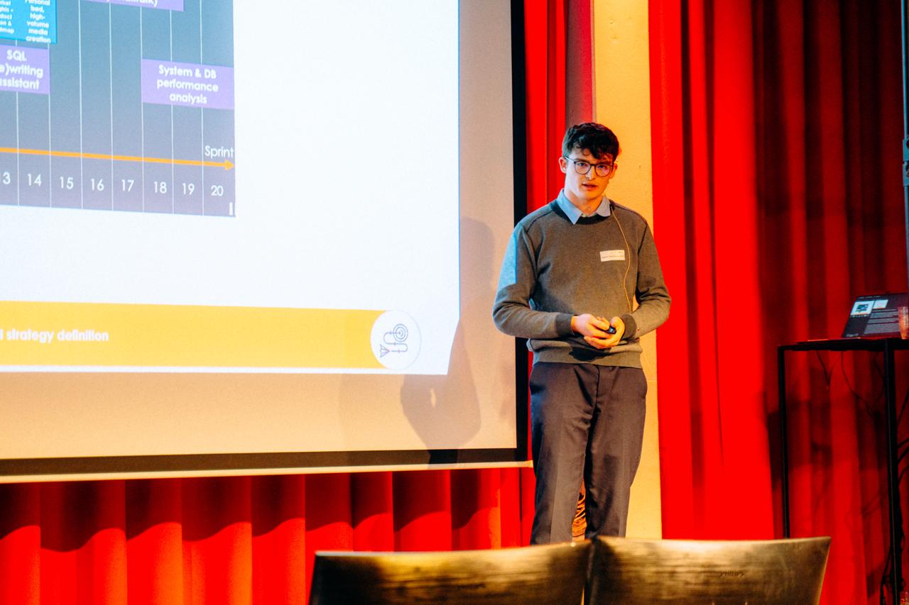

# My first months at [AE](https://www.ae.be/)

*TL;DR: In my first months at AE I had 2 weeks of interesting training together with a fun group, competed in a 3 day hackathon, got my first project at Mediagenix and had the opportunity to present our work at the AE kick-off in front of 200+ people.*

## The apprenticeship

My first 2 weeks at AE, I had training sessions together with the other 14 starters. We learned about: 
- Requirements Management
- Functional Analysis & Design
- Information Management
- Application Architecture
- Technical Architecture
- Integration Architecture
- Soft skills
- Data engineering in Microsoft Fabric
- ...

These were really fun weeks, learning about practical stuff, but most importantly getting to know AE and the other people starting their career. In this short time period, we really became more than just a group of colleagues.

## [Vlaanderen Hackathon 2025](https://www.vlaanderen.be/digitaal-vlaanderen/nieuws/doe-mee-aan-de-vlaanderen-hackathon-2025-samen-hacken-voor-een-slimmere-toekomst)

I got the opportunity to compete, together with a team of AE colleagues, people of the City of Mechelen and imec. We built a chatbot (Mevin) to assist citizens of Mechelen with all questions related to mobility. In the end, we were not nominated for the final, but it was an extremely fun experience. Fleshing out the needed specs, trying things out, working against the time (as we only really had 2 days for building). We did have a fully working prototype, that we were able to show at the presentation. You can chat with it and ask questions about anything that is on the Mobility website, talk with it, it can show you the best way to reach the city, give parking tips... The demo of chatbot is still [online](https://mevin-17102025.azurewebsites.net/), so check it out!

## My first project: AI-first strategy at Mediagenix

In oktober 2026, I got my first project: an AI-first strategy project at Mediagenix. I got the role of AI analyst/pilot engineer. We did a lot of interviews, workshops, inspiration sessions and brainstorms to create a strategy about how to implement an AI reflex, how to implement internal AI use cases, how to govern the bottom-up initiatives... In the end we delivered a strategy one-liner, a roadmap with use-cases, and a fully fleshed out operating model. As an extra I also developed a chatbot that could answer questions about the progress of our project that was exposed to client and built an PoC for one of the use cases.

We must have done something right, as we were asked to stay a little longer and also help with the implementation of the use cases. So I get to work as an AI engineer!

Bonus: At the kick-off at AE, I also got to present our project in front of 200+ AE-colleagues, pretty exiting 😅

