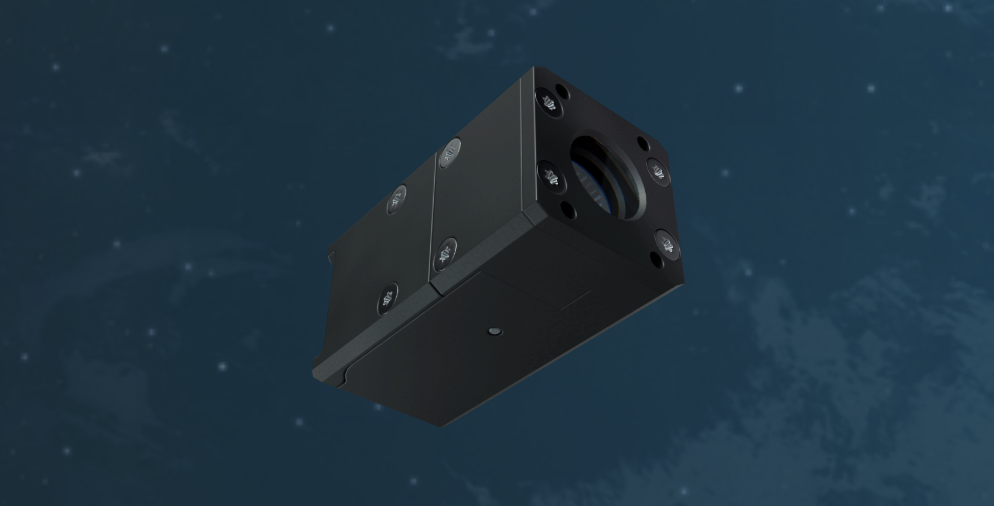

# My Student Jobs

*TL;DR: During my studies I worked as a software developer at a space tech startup, data analyst and finance employee at an IT company. Each teaching me different skills and showing me what I enjoy (and don't enjoy) doing*

## Data Analyst at Fifthnet (Summer 2021)

This was my first proper exposure to working with data and I loved it!

The highlight was designing and implementing a Power BI dashboard for weekly progress meetings. I got to:
- Designed a dynamic Power BI dashboard tailored for weekly progress meetings, enabling stakeholders to monitor key metrics and project milestones.
- Integrated user-friendly visuals and filters for intuitive exploration of data trends and anomalies.
- Ensured alignment with business objectives by incorporating KPIs relevant to operational efficiency and data quality improvements.
- Developed an automated data pipeline using Power BI and supporting tools (e.g., Power Query, scheduled refreshes via Power BI Service).
- Ensured seamless integration between source systems and dashboards, minimizing manual intervention and reducing latency.
- Scheduled refreshes to align with daily reporting cycles, ensuring stakeholders always had access to up-to-date insights.

This job showed me that I really enjoy making things that help people understand complex information better. It also made it very clear I have no detectable UX/UI talent. As I did not get the budget to set-up a reliable data platform, I was limited to importing data directly from Excel. Here I learned hands-on the problems that may come from this.

## Finance Employee at A&C Systems (Summer 2022)

Here I worked in the finance department. I spent my days booking and matching invoices and credit notes, and visualizing results in Excel. 

This taught me what I *didn't* want to do. While I appreciated learning about the business side of things and Excel wizardry, I quickly realized that sitting behind a desk all day doing repetitive administrative tasks wasn't for me. But hey, at least I got pretty good at Excel formulas and learned to appreciate the importance of clean financial administration! It also made me realize that the average computer knowledge of people is a lot lower than I previously expected, I could blow peoples mind by making a simple pivot table in Excel.

## Software Developer at Arcsec NV (Summer 2023 - 2025)

This was by far my favorite student job and I worked there for almost two years! [Arcsec](https://www.arcsec.space/) is a space tech startup that develops StarTrackers (cool name, I know). These are devices that help satellites orient themselves in space by looking at the stars and based on the position of them figure out the orientation of the satellite. Working in a startup environment was incredibly different from my previous jobs: fast-paced, innovative, and full of learning opportunities. I got to work with a lot of really intelligent people from all over the world, that were working on crazy algorithms using quaternion math.

### What I actually did

**Communication Interface for StarTrackers**: I developed a Python interface that enabled reliable data exchange with StarTracker devices. This meant being able to log telemetry coming from the device, setting parameters, running commands... Here I learned working in a pretty large existing code-base with already some complex concepts and design choices.

**Real-Time Telemetry Dashboard**: This was the project I'm most proud of! I designed and built a PyQt-based dashboard that could visualize real-time telemetry data at 10Hz, **10x faster** than the previous dashboard. Seeing those performance improvements was incredibly satisfying. The dashboard was even showcased at multiple conferences, and is still in use to this day (for example at [SmallSat Europe](https://www.linkedin.com/posts/arcsec_its-day-1-of-smallsat-europe-2025-in-amsterdam-activity-7333038433113698304-n_JC?utm_source=share&utm_medium=member_desktop&rcm=ACoAAEGEaGUBpa1syEkomNPDvq_WFGxi_xt5924) and at their [5 year anniversary](https://www.linkedin.com/posts/arcsec_5-years-in-orbit-activity-7407360583068565504-QKuT?utm_source=share&utm_medium=member_desktop&rcm=ACoAAEGEaGUBpa1syEkomNPDvq_WFGxi_xt5924)), which was pretty cool for a student project!

**Experiment Automation**: I developed an interface for automatic, periodic execution of experiments. Basically, I made it so experiments could run themselves without someone having to manually start them every time. Before this, people did all-nighters making sure the StarTracker was still working correctly, changing parameters, pinging the device... I gave them some more sleep 😉

### What I learned beyond coding

Working at a startup taught me so much more than just technical skills:

- **Adaptability**: Priorities change fast in a startup. You need to be flexible and ready to switch gears when needed
- **Taking ownership**: I was responsible for entire features from design to deployment. No hand-holding, but also incredibly rewarding
- **Communication**: I learned to explain technical concepts to people who know nothing about what I was working on
- **Problem-solving under constraints**: Limited resources mean you need to be creative with solutions
- **Presentation skills**: Got comfortable presenting technical work in meetings, which initially terrified me

## What these experiences taught me

Looking back at these three jobs, I learned that I really enjoy:
- Building tools that make people's lives easier
- Seeing tangible performance improvements in what I create
- Working in environments where I can take ownership of projects
- Automating things
- Explaining complex technical things in simple ways

And I learned I don't enjoy:
- Repetitive administrative tasks (looking at you, invoice matching)
- Work where I can't see the direct impact of what I'm doing

These student jobs were invaluable in helping me figure out what direction I want to take my career. Plus, I got to work on some genuinely cool projects, how many students can say they helped build technology that goes to space?
